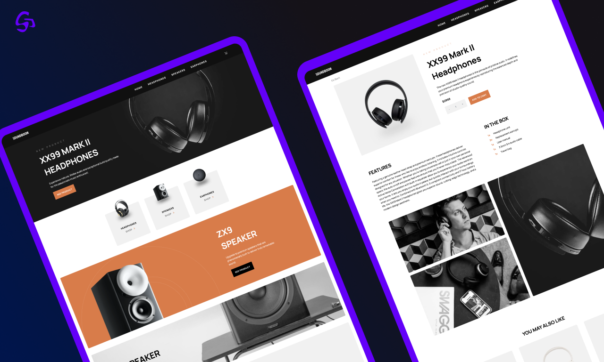
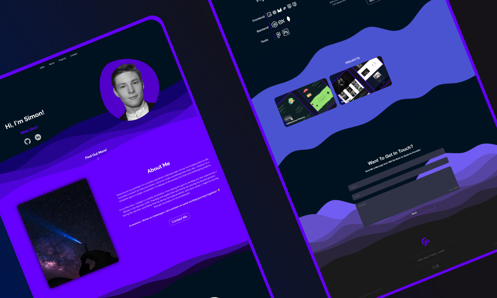

# ✨Welcome to my github profile✨

Thanks for stopping by! If you see anything you like, let me know!

## A Fullstack-developer based in Malmö, Sweden.

I live in a small apartment with my partner and way too many plants.
I have great plans for the future and cant wait to leave my mark on the products and websites of the future!

Once again, Thank you for taking the time to visit!

🔭Head over to my page to see what i am working on🔭

### Go to the [portfoliopage](https://www.gustavssondev.com/)

## 🌱No Nonsense Budget - Fullstack - A simple to use finance app🌱

### The smooth budgeting platform!

A simple and minimalistic budgeting app. A free to use system i developed over the summer. 

Visit the application [here!](https://www.nononsensebudget.com/)

## Soundboom - Fullstack - E-commerce

### Find Your New Sound!

Soundboom is a custom e-commerce project with advanced statehandling and a responsive design. Soundboom has everything from headphones to speakers on a clean and inviting page!

you can check out the app so far by clicking [here!](https://soundboom-pi.vercel.app/product)

## Digital Portfolio 2024

### My growing stack

On my portfolio webpage you can check out my current techstack, some of my recent projects and current ideas.

I have also added the ability to send me emails trough a nice looking form.

I try to keep the portfolio updated and every so often i redesign it.

Check it out [here](https://www.yret1.se/)

**Dont hesitate to get in touch!💬**
