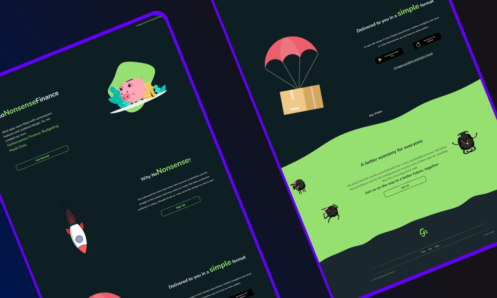

# ✨Welcome to my github profile✨

Thanks for stopping by! If you see anything you like, let me know!

## Hi! I'm Simon, A Fullstack-developer based in Malmö, Sweden.

I live in a small apartment with my partner and way too many plants.
I have great plans for the future and cant wait to leave my mark on the products and websites of the future!

Once again, Thank you for taking the time to visit!

🔭Keep reading to see what i'm currently working on!🔭

[ LinkedIn](https://www.linkedin.com/in/simon-gustavsson-94b50090/)
 

## 🌱noNonsenseFinance - Fullstack - Current main project🌱

### A budgeting platform of the future!

With noNonsense im trying to create a new modern way of budgeting. Utilizing a clean minimalistic design and smooth colors. I hope that this project will find its way into hearts of many users!

you can check out the app so far by clicking [here!](https://nononsensefinance.netlify.app/)

## Soundboom - Fullstack - E-commerce

### Find Your New Sound!

Soundboom is a custom e-commerce project with advanced statehandling and a responsive design. Soundboom has everything from headphones to speakers on a clean and inviting page!

you can check out the app so far by clicking [here!](https://soundboom-pi.vercel.app/product)

## Digital Portfolio 2024

### My growing stack

On my portfolio webpage you can check out my current techstack, some of my recent projects and current ideas.

I have also added the ability to send me emails trough a nice looking form.

I try to keep the portfolio updated and every so often i redesign it.

Check it out [here](https://www.yret1.se/)

**Dont hesitate to get in touch!💬**
<!--
**yret1/yret1** is a ✨ _special_ ✨ repository because its `README.md` (this file) appears on your GitHub profile.

Here are some ideas to get you started:

- 🔭 I’m currently working on ...
- 🌱 I’m currently learning ...
- 👯 I’m looking to collaborate on ...
- 🤔 I’m looking for help with ...
- 💬 Ask me about ...
- 📫 How to reach me: ...
- 😄 Pronouns: ...
- ⚡ Fun fact: ...
-->
