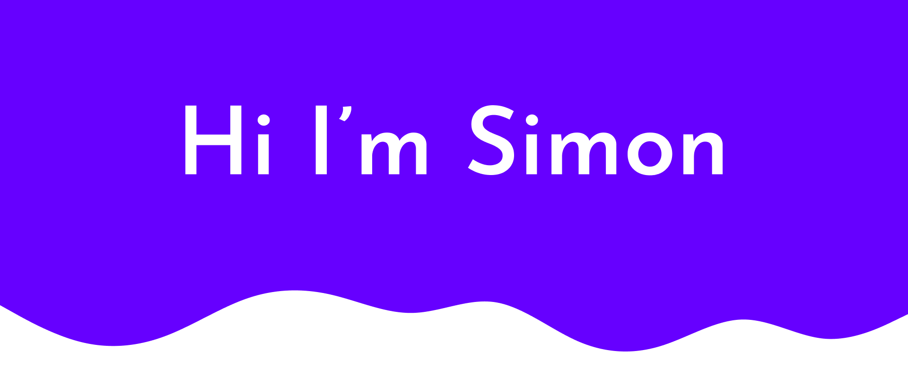
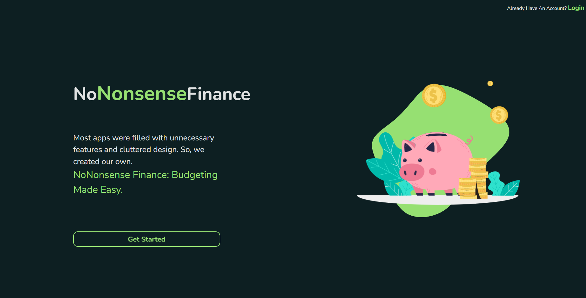
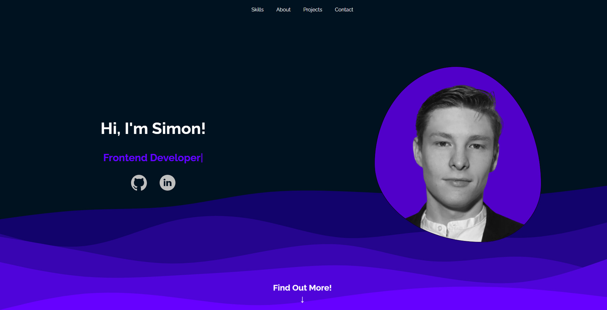

# ✨Welcome to my github profile✨

🔭Check out some of my repos and projects🔭

Keep reading to see what i'm currently working on!

## 🌱noNonsenseFinance - Fullstack - Current main project🌱

### A budgeting platform of the future!

With noNonsense im trying to create a new modern way of budgeting. Utilizing a clean minimalistic design and smooth colors. I hope that this project will find its way into hearts of many users!

you can check out the app so far by clicking [here!](https://nononsensefinance.netlify.app/)

## 😄My Portfolio Page😄

### My growing stack

On my portfolio webpage you can check out my current techstack, some of my recent projects and current ideas.

I have also added the ability to send me emails trough a nice looking form.

Check it out [here](https://www.yret1.se/)

**Dont hesitate to get in touch!💬**
<!--
**yret1/yret1** is a ✨ _special_ ✨ repository because its `README.md` (this file) appears on your GitHub profile.

Here are some ideas to get you started:

- 🔭 I’m currently working on ...
- 🌱 I’m currently learning ...
- 👯 I’m looking to collaborate on ...
- 🤔 I’m looking for help with ...
- 💬 Ask me about ...
- 📫 How to reach me: ...
- 😄 Pronouns: ...
- ⚡ Fun fact: ...
-->
